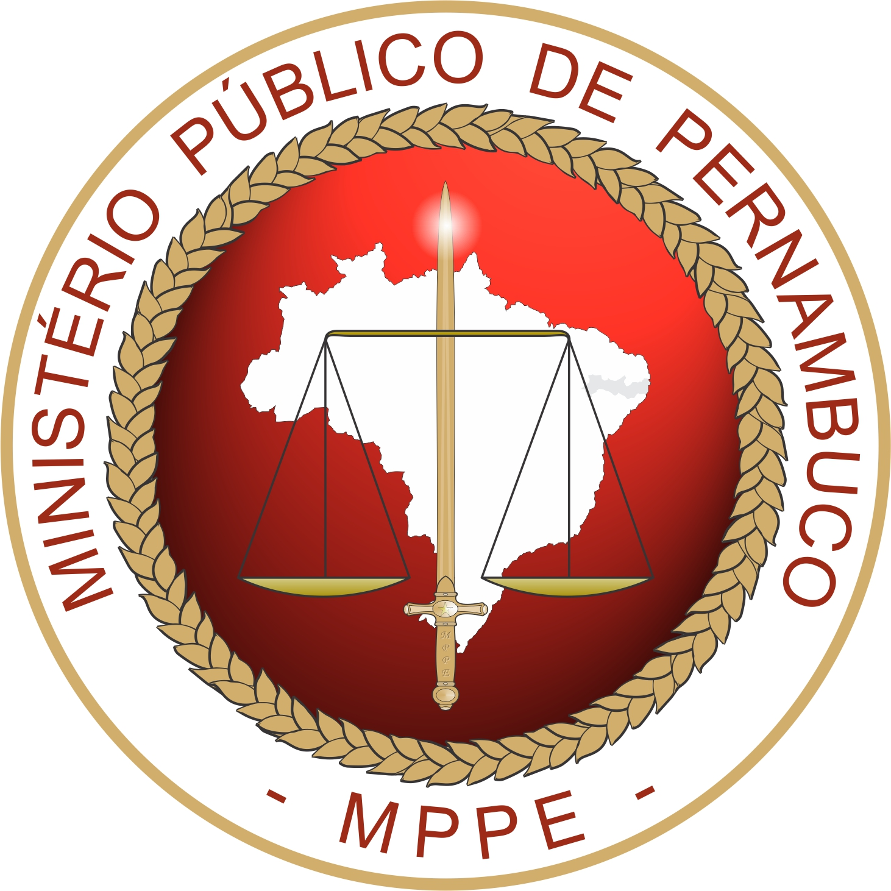

# SIPAT — Sistema Integrado Patrimonial

<div align="center">



**Desenvolvido para o Ministério Público de Pernambuco**


</div>

---

## Índice

- [Sobre o Projeto](#sobre-o-projeto)
- [Screenshots](#screenshots)
- [Módulos](#módulos)
- [Stack](#stack)
- [Instalação](#instalação)
- [Variáveis de Ambiente](#variáveis-de-ambiente)
- [Rodando com Docker](#rodando-com-docker)
- [Estrutura do Projeto](#estrutura-do-projeto)
- [Diagramas](#diagramas)
- [Contribuindo](#contribuindo)
- [Autor](#autor)

---

## Sobre o Projeto

O **SIPAT** é um sistema web interno desenvolvido sob demanda para o **Ministério Público de Pernambuco (MPPE)**, mais especificamente para o **DEMPAM — Departamento de Material e Patrimônio**. O sistema nasceu da necessidade de digitalizar e centralizar processos que antes eram feitos manualmente ou em planilhas dispersas, sem rastreabilidade nem controle unificado.

O DEMPAM é o setor responsável por abastecer todas as Unidades Administrativas (UAs) do MPPE com materiais de consumo e por controlar o patrimônio permanente tombado da instituição. Com dezenas de UAs distribuídas pelo estado de Pernambuco, o volume de solicitações, movimentações e controles era inviável sem uma ferramenta adequada.

### O que o SIPAT resolve

| Funcionalidade | Descrição |
|---|---|
| **Solicitações de materiais** | UAs solicitam bens de consumo diretamente pelo sistema. O DEMPAM recebe, analisa, separa e expede, com rastreamento em tempo real de cada etapa da tramitação. |
| **Controle de estoque** | O estoque do almoxarifado é atualizado automaticamente conforme as solicitações avançam no fluxo, eliminando divergências entre o sistema e o estoque físico. |
| **Gestão de contratos** | Contratos com fornecedores são cadastrados com seus respectivos saldos. Solicitações podem ser vinculadas a contratos ativos, com baixa automática do saldo disponível. |
| **Processo licitatório** | Artefatos de licitação (TR, ETP, RGPP, DODE, TAPP, Análise de Risco) são gerenciados dentro do sistema, com controle de estado e vinculação a propostas de fornecedores. |
| **Patrimônio permanente** | Bens tombados são cadastrados com ficha completa (tombo, marca, modelo, valor, estado de conservação, situação física) e têm seu histórico de movimentação entre UAs registrado a cada transferência. |
| **Rastreabilidade total** | Cada movimentação de bem permanente gera um registro imutável com origem, destino, responsável e data. O histórico de UAs por onde o bem passou fica preservado. |
| **Uso externo** | Bens emprestados a servidores externos são registrados com responsável, CPF do usuário, contato e data de renovação. |

### Contexto institucional

O sistema foi entregue ao **MPPE/DEMPAM** e está em uso interno. Todo o ciclo de desenvolvimento foi conduzido pelo autor — desde o levantamento de requisitos com o setor, passando pela modelagem do banco de dados, desenvolvimento de cada módulo, até a implantação e manutenção evolutiva do sistema.

---

## Screenshots

### Homepage

> _[ insira screenshot aqui ]_

---

### DIMMS — Almoxarifado

> _[ insira screenshot aqui ]_

---

### DIMRCBP — Bens Permanentes

> _[ insira screenshot aqui ]_

---

### DEMPAM — Painel Gerencial

> _[ insira screenshot aqui ]_

---

### Admin

> _[ insira screenshot aqui ]_

---

## Módulos

Visão detalhada dos 4 módulos de negócio abaixo. Para como eles se relacionam entre si (e com `accounts`), veja os diagramas C4 em [`docs/architecture.md`](docs/architecture.md).

### `accounts` — Gestão de Acesso

Usuários, perfis e permissões — base de autenticação/autorização usada por todos os demais módulos.

| Model | Descrição |
|---|---|
| `Profile` | Perfil do usuário (foto, telefone, bio, UAs vinculadas/geridas) |
| `RegistroAcesso` | Registro de acessos do usuário ao sistema |
| `Feedback` | Feedback enviado pelos usuários |

---

### `dempam` — Estrutura Base

Cadastros centrais compartilhados pelos demais módulos: UAs, prédios, circunscrições e localizações físicas.

| Model | Descrição |
|---|---|
| `CircunscricaoPredio` | Prédios e circunscrições geográficas |
| `Municipio` | Municípios de Pernambuco e sua circunscrição |
| `InfoUA` | Unidades Administrativas (responsável, contato, sede, município) |
| `SetorDEMPAM` | Setores e salas internas do DEMPAM |
| `LocalizacaoDEMPAM` | Localizações físicas (prateleiras, pallets) |
| `Aviso` | Mural de avisos exibido na homepage |
| `ConfiguracaoPainelTV` | Configuração do painel de inventário exibido em TV |

---

### `demands` — Demandas e Tickets

Fluxo interno de abertura, atribuição e acompanhamento de demandas entre setores.

| Model | Descrição |
|---|---|
| `DemandType` | Tipos de demanda configuráveis (cor, ícone, grupos permitidos) |
| `Demand` | Demanda (título, descrição, prioridade, status, prazo) |
| `DemandAssignment` | Atribuição de usuários a uma demanda |
| `DemandAttachment` | Anexos da demanda |
| `DemandUpdate` | Histórico de atualizações/comentários |

---

### `dimms` — Bens de Consumo

Controla o ciclo completo dos bens de consumo: do estoque à entrega, incluindo contratos, licitação e catálogo de autoatendimento.

| Model | Descrição |
|---|---|
| `BensConsumo` | Catálogo de itens (E-Fisco) |
| `Supplier` | Fornecedores |
| `Contrato` | Contratos com fornecedores |
| `AditivoContrato` | Aditivos de prazo/valor a um contrato |
| `SaldoAtivo` | Saldo de itens por contrato |
| `Estoque` | Estoque físico do DEMPAM |
| `Solicitacao` | Solicitações de materiais pelas UAs (`SBC-YYYY-XXXX`) |
| `SolicitacaoItens` | Itens de cada solicitação |
| `Tramitacao` | Histórico de tramitação — baixa o estoque automaticamente |
| `BensEnviados` | Registro dos itens efetivamente enviados |
| `SolicitacoesSaldoAtivo` | Solicitações via saldo de contrato (`SSA-YYYY-XXXX`) |
| `ItensSolicitados` | Itens das solicitações de saldo ativo |
| `CatalogoConsumo` | Catálogo de autoatendimento para as UAs |
| `SolicitacaoCatalogoConsumo` | Solicitações feitas via catálogo de autoatendimento |
| `ItemSolicitacaoCatalogoConsumo` | Itens de cada solicitação do catálogo |
| `PeriodoInventarioConsumo` | Períodos de conferência de estoque de consumo |
| `ConferenciaEstoque` | Registro de conferência de itens do estoque |
| `Artifacts` | Artefatos de licitação (TR, ETP, RGPP, DODE, TAPP) |
| `ItensArtifacts` | Itens vinculados a artefatos |
| `Proposal` | Propostas de fornecedores |
| `ItensProposal` | Itens de cada proposta |
| `Subject` / `Sei` / `SeiUpdate` | Acompanhamentos de processos SEI |

**Fluxo de solicitação:**
```
UA cria Solicitação → adiciona Itens → Tramitação
Em Atendimento → Aguardando Separação → Separada → Em Expedição → Recebida
                                ↑
                    Estoque baixado automaticamente
```

---

### `dimrcbp` — Bens Permanentes

Controla o patrimônio permanente tombado: cadastro, movimentação entre UAs, uso externo e inventário periódico.

| Model | Descrição |
|---|---|
| `Groups` | Grupos de bens permanentes |
| `Type` | Tipos de bens (vinculado ao grupo) |
| `Description` | Descrição detalhada (cor, tamanho, BTU/HP) |
| `Supplier` | Fornecedores de bens permanentes |
| `BensPermanentes` | Bens tombados (tombo, marca, modelo, valor) |
| `HistoryUas` | UA atual e histórico de UAs por onde o bem passou |
| `AtribuicaoBem` | Responsável atual pelo bem dentro da UA |
| `HistoricoMudanca` | Audit trail de alterações no bem (nunca deletado) |
| `UseExternal` | Registro de acautelamento (uso externo do bem) |
| `MovimentacaoBem` | Movimentações entre UAs (transferência, devolução) |
| `SolicitacaoTransferencia` | Solicitação de transferência de bem entre UAs |
| `PeriodoInventario` / `Inventario` | Períodos de inventário e conferência dos bens |
| `Catalogo` / `SolicitacaoCatalogo` / `ItemSolicitacaoCatalogo` | Catálogo de bens permanentes para requisição pelas UAs |

---

### `manutencao` — Estoque de Manutenção

Módulo em expansão. Hoje cobre o estoque de bens de manutenção (entrada por E-Fisco, saída por consumo), reaproveitando a localização física do `dempam`.

| Model | Descrição |
|---|---|
| `EstoqueManutencao` | Item de manutenção em estoque (E-Fisco, quantidade, localização) |

---

## Stack

| Tecnologia | Versão | Uso |
|---|---|---|
| Python | 3.14 | Linguagem principal |
| Django | 6.0.2 | Framework web |
| PostgreSQL | 16 | Banco de dados (produção) |
| SQLite | — | Banco de dados (desenvolvimento) |
| Authentik (OIDC) | — | Autenticação institucional |
| Gunicorn | 23.0.0 | Servidor WSGI |
| WhiteNoise | 6.9.0 | Arquivos estáticos |
| django-localflavor | 5.0 | Validações brasileiras (CPF, CNPJ) |
| Pillow | 12.1.0 | Processamento de imagens |
| qrcode | 7.4.2 | Geração de QR Code para bens |
| ReportLab | 4.0.9 | Geração de PDFs |
| openpyxl | 3.1.5 | Importação/exportação de planilhas |

---

## Instalação

### Desenvolvimento local (SQLite)

```bash
# Clone o repositório
git clone <url-do-repo>
cd sipat

# Crie e ative o ambiente virtual
python -m venv venv
venv\Scripts\activate        # Windows
# source venv/bin/activate   # Linux/macOS

# Instale as dependências
pip install -r requirements.txt

# Aplique as migrações
python manage.py migrate

# Crie o superusuário
python manage.py createsuperuser

# Rode o servidor
python manage.py runserver
```

Acesse em `http://localhost:8000`.

---

## Variáveis de Ambiente

Crie um arquivo `.env` na raiz do projeto com as seguintes variáveis:

| Variável | Descrição |
|---|---|
| `DJANGO_SECRET_KEY` | Chave secreta do Django |
| `DJANGO_SETTINGS_MODULE` | Módulo de settings (ex.: `app.settings.development`) |
| `DB_NAME` | Nome do banco PostgreSQL |
| `DB_USER` | Usuário do banco PostgreSQL |
| `DB_PASSWORD` | Senha do banco PostgreSQL |
| `OIDC_RP_CLIENT_ID` | Client ID do Authentik |
| `OIDC_RP_CLIENT_SECRET` | Client Secret do Authentik |

---

## Rodando com Docker

Para usar PostgreSQL localmente com Docker:

```bash
docker compose up
```

O Docker Compose sobe dois serviços:

- **`db`** — PostgreSQL 16 com healthcheck
- **`web`** — Django + Gunicorn, executa migrações e collectstatic automaticamente na inicialização

Certifique-se de que o `.env` contém as variáveis `DB_NAME`, `DB_USER` e `DB_PASSWORD`.

---

## Estrutura do Projeto

Cada app de negócio vive na raiz do repositório (convenção padrão do Django) e segue **sempre a mesma estrutura interna**, o que torna qualquer app previsível de navegar assim que se conhece um deles:

```
<app>/
├── models/ (ou models.py)  # Entidades do domínio
├── views/                  # Views divididas por arquivo de contexto
├── templates/<app>/        # HTML do app
├── migrations/             # Migrações geradas automaticamente
├── urls.py                 # Rotas do app, sob namespace próprio
├── admin.py                # Registro no Django Admin
├── forms.py                # Formulários (quando houver)
├── utils.py                # Choices (TextChoices) e upload paths
└── tests.py (ou tests/)
```

```
sipat/
├── app/               # Configuração central (settings, urls, wsgi)
│   └── settings/
│       ├── base.py
│       ├── development.py   # SQLite · form de login
│       ├── local.py         # PostgreSQL (Docker) · form de login
│       ├── staging.py       # PostgreSQL · OIDC
│       └── production.py    # PostgreSQL · OIDC
├── accounts/          # /access/     — usuários, perfis, grupos, permissões
├── dempam/            # /dempam/     — UAs, prédios, setores, localizações
├── demands/           # /demands/    — demandas e tickets internos
├── dimms/             # /dimms/      — bens de consumo, estoque, contratos, licitações
├── dimrcbp/           # /dimrcbp/    — bens permanentes, movimentações, inventário
├── manutencao/        # /manutencao/ — estoque de bens de manutenção (módulo em expansão)
├── templates/         # Templates globais (base.html e afins)
├── static/            # Arquivos estáticos (logo, ícones, CSS/JS globais)
├── docs/              # Documentação adicional e diagramas
│   └── architecture.md   # Diagramas C4 (contexto, containers, componentes, entidades, fluxos)
├── sipat.drawio       # Diagrama de entidades (draw.io)
├── docker-compose.yml
└── requirements.txt
```

---

## Diagramas

A documentação arquitetural completa (C4 — contexto, containers, componentes, entidade-relacionamento por módulo e fluxos de sequência) está em [`docs/architecture.md`](docs/architecture.md).

O arquivo `sipat.drawio` complementa com os diagramas de entidade-relacionamento organizados por páginas:

- **contract** — Fluxo de contratos e fornecedores
- **DIMMS** — Estrutura de bens de consumo
- **DIMRCBP** — Estrutura de bens permanentes
- **DEMPAM** — Estrutura base (UAs e localizações)

---

## Contribuindo

Consulte os documentos abaixo antes de contribuir:

- [CONTRIBUTING.md](CONTRIBUTING.md) — como configurar o ambiente, convenções de commits e fluxo de PRs
- [CODE_OF_CONDUCT.md](CODE_OF_CONDUCT.md) — padrões de comportamento esperados
- [SECURITY.md](SECURITY.md) — como reportar vulnerabilidades

---

## Autor

**Caio Agrelli** — Engenheiro de Software Responsável
Desenvolvimento e gestão do SIPAT — MPPE/DEMPAM
