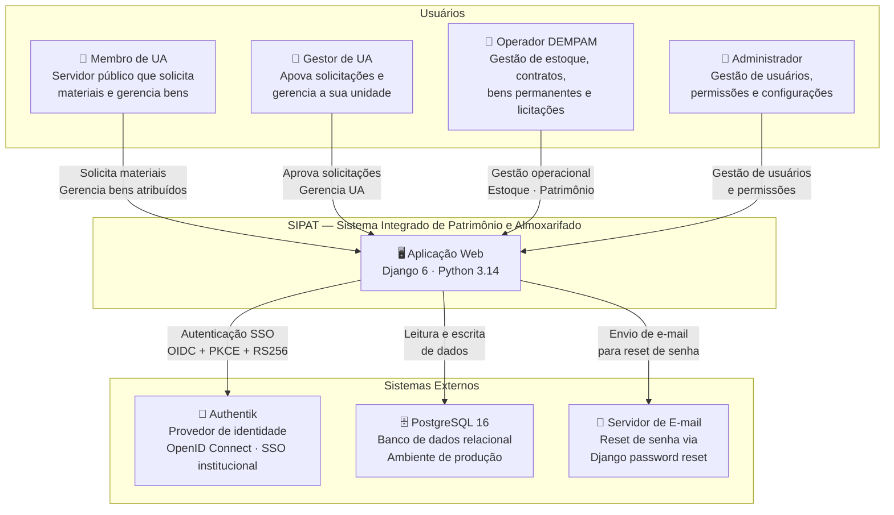
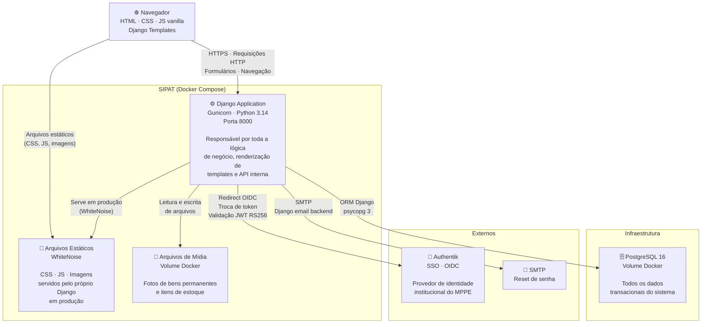
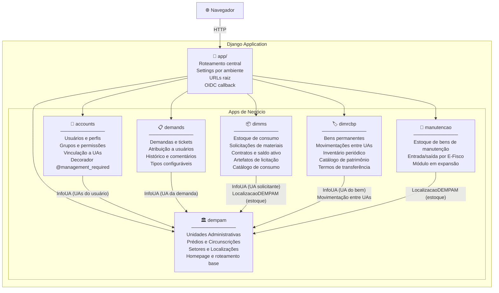
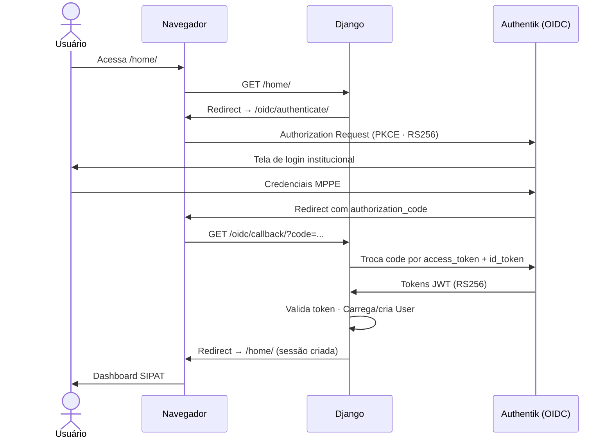
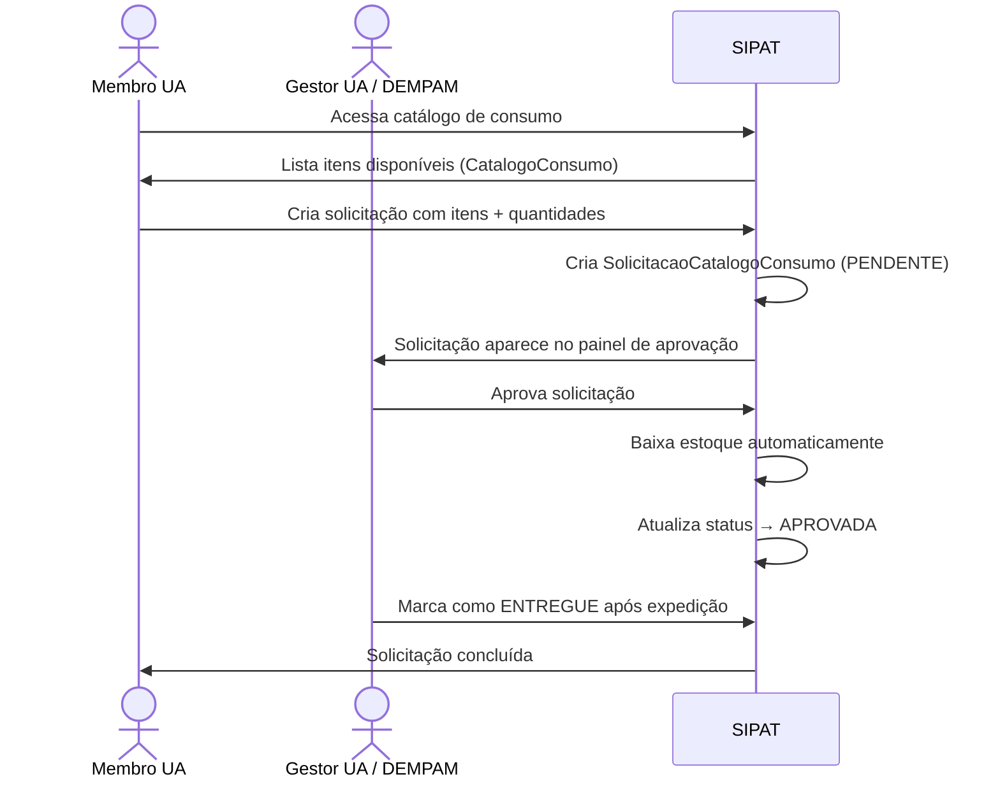
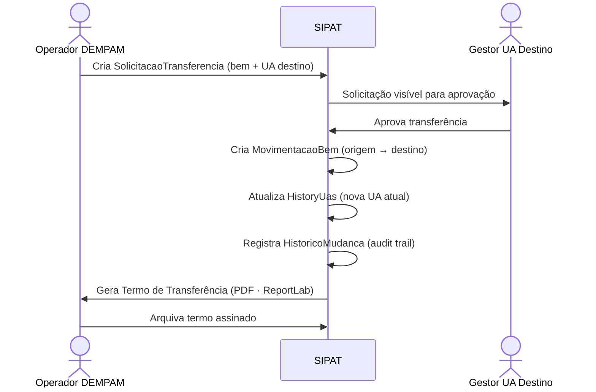

# Arquitetura do SIPAT — Modelo C4

> Documentação arquitetural nos 3 primeiros níveis do modelo C4 (Context, Container, Component).

---

## Nível 1 — Contexto do Sistema

Visão macro: quem usa o SIPAT e com quais sistemas externos ele se comunica.

---

## Nível 2 — Containers

Visão das peças tecnológicas que compõem o sistema e como se comunicam.

---

## Nível 3 — Componentes

Visão interna da aplicação Django: seus módulos (apps) e as responsabilidades de cada um.

---

## Fluxos Principais

### Autenticação

---

### Solicitação de Material (DIMMS)

---

### Transferência de Bem Permanente (DIMRCBP)

---

## Ambientes

| Ambiente | Settings | Banco | Autenticação | Obs. |
|---|---|---|---|---|
| `development` | `app.settings.development` | SQLite | Django auth (form) | Padrão para devs |
| `local` | `app.settings.local` | PostgreSQL (Docker) | Django auth (form) | Docker Compose local |
| `staging` | `app.settings.staging` | PostgreSQL | OIDC (Authentik) | Homologação |
| `production` | `app.settings.production` | PostgreSQL | OIDC (Authentik) | MPPE produção |
